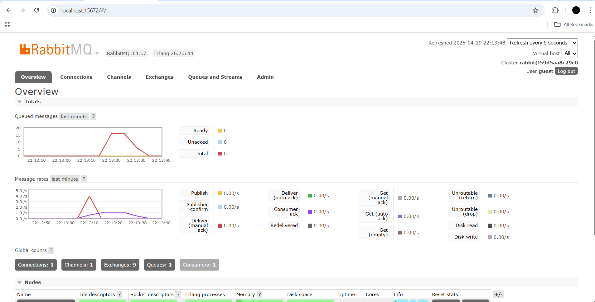
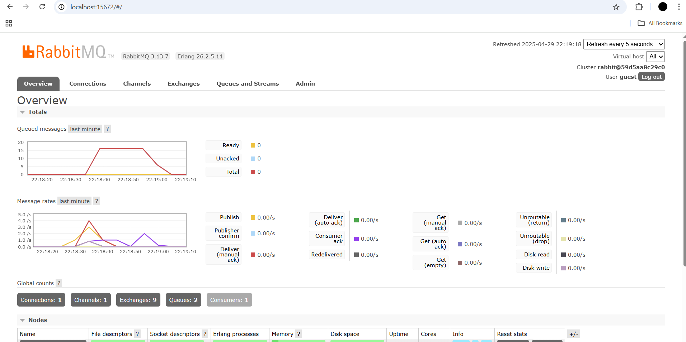
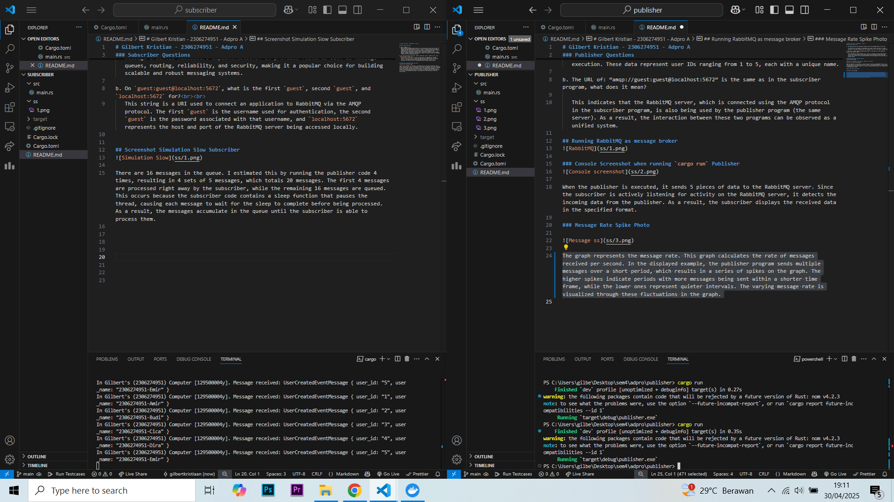

# Gilbert Kristian - 2306274951 - Adpro A

### Subscriber Questions

a. What is AMQP?  
   AMQP (Advanced Message Queuing Protocol) is an application layer protocol used for message exchange between applications or systems. It enables different systems to communicate with each other in a reliable, secure, and asynchronous manner. AMQP is commonly used in distributed systems, cloud computing environments, and message-oriented middleware implementations. It provides features such as message queues, routing, reliability, and security, making it a popular choice for building scalable and robust messaging systems.

b. On `guest:guest@localhost:5672`, what is the first `guest`, second `guest`, and `localhost:5672` for?  
   This string is a URI used to connect an application to RabbitMQ via the AMQP protocol. The first `guest` is the username used for authentication, the second `guest` is the password associated with that username, and `localhost:5672` represents the host and port of the RabbitMQ server being accessed locally.

## Screenshot Simulation Slow Subscriber

There are 16 messages in the queue. I estimated this by running the publisher code 4 times, resulting in 4 sets of 5 messages, which totals 20 messages. The first 4 messages are processed right away by the subscriber, while the remaining 16 messages are queued. This occurs because the subscriber code contains a sleep function that pauses the thread, causing each message to wait for the sleep to complete before being processed. As a result, the messages accumulate in the queue until the subscriber is able to process them.

## Spike on Queued Messages with Multiple Subscribers Sreenshots
  

In this example, I ran the publisher code 5 times. The first run is spaced out slightly, while the next 4 runs occur consecutively. In this case, there are only a maximum of 8 queued messages. This is because event processing is handled separately, with each subscriber taking and processing one message at a time. As a result, more messages can be processed simultaneously by different subscribers, which reduces the number of messages that need to be queued.

One improvement that can be made in both the subscriber and publisher code is implementing parallelism in the publisher. This would allow multiple requests to be sent at once, simulating high traffic conditions more accurate.

